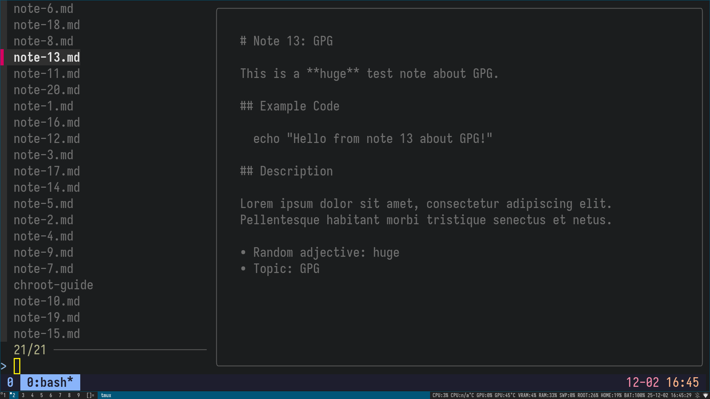
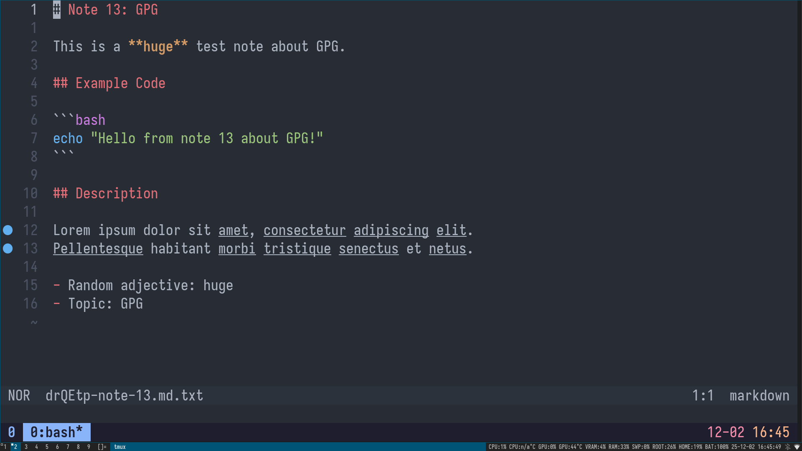

# Note

`note` is a minimal markdown note tool using GNU Pass.

## Features

* Inherit all from GNU Pass.
* Fuzzy selection with fzf
* Preview markdown with glow
* Search note contents with ripgrep

## Installation

```bash
sudo apt install pass gnupg fzf glow ripgrep
cp note ~/.local/bin/note
chmod +x ~/.local/bin/note
note init <gpg-id>
```

## Usage

```bash
note             # list notes
note grep Linux  # search notes
note edit note-1 # edit a note
```

## Warning
All notes must be created at the top level; sub-folders are not permitted.

## Preview



